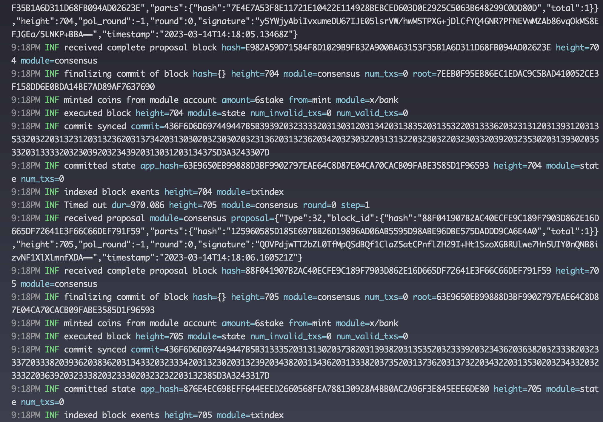

Goal:

- Learners should understand how to interact with Tendermint node
- Learners should be able to scaffold and start a chain

# Lesson 1: Scaffolding and starting a chain

## Ignite CLI

https://docs.ignite.com/

Should only use Ignite CLI for scaffolding chain

## Guidelines

1. Download ignite CLI from: https://docs.ignite.com/#install-ignite-cli
2. Scaffold a new chain: 
```sh
ignite scaffold chain lesson_1
```

3. Start chain:
```sh
ignite chain serve
```
Output:
```sh
Blockchain is running
✔ Added account alice with address cosmos1fndyme3ypln0x7rqsk07kf4h4fl0txr89cd4kl and mnemonic:
clip need broccoli amount urge loud about curtain trade demand tenant victory
pulse filter insect right autumn prefer velvet settle violin strike proof foot

✔ Added account bob with address cosmos1fhmuvc6gaya2jvjndms08dfc8k0f68eh0u44wq and mnemonic:
guess brass kit flower gentle name enjoy federal fee choice since surge manual
erase border lamp napkin bring network purse uphold recall common dog
```
4. Install chain binary (a software that runs a node)
```sh
go install ./...
```
Output: 
```sh
~/go/bin/lesson_1d
```
5. Initialize a chain
```sh
~/go/bin/lesson_1d init temp_chain --chain-id chain-testnet
```
6. Add a validator
```sh
~/go/bin/lesson_1d keys add validator --keyring-backend test
```
Output: 
```sh
- address: cosmos13zrwn8006df5ek2t8quj5hexja06dx3d8cf7v0
  name: validator
  pubkey: '{"@type":"/cosmos.crypto.secp256k1.PubKey","key":"AivruUye/7we0ERC6Iwfhwy2LG3BBSwsXiHt6DC77UDf"}'
  type: local

**Important** write this mnemonic phrase in a safe place.
It is the only way to recover your account if you ever forget your password.

pottery plunge hero year bronze voyage visual sure pluck funny shoot drink rapid trend text light donkey holiday meat chimney clock gospel bleak school
```
```sh
~/go/bin/lesson_1d add-genesis-account cosmos13zrwn8006df5ek2t8quj5hexja06dx3d8cf7v0 10000000stake --keyring-backend test
~/go/bin/lesson_1d gentx validator 1000000stake --chain-id chain1-testnet --keyring-backend test
~/go/bin/lesson_1d collect-gentxs
~/go/bin/lesson_1d validate-genesis
```
7. Start chain
```sh
~/go/bin/lesson_1d start
```
